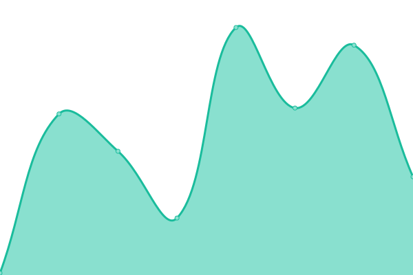
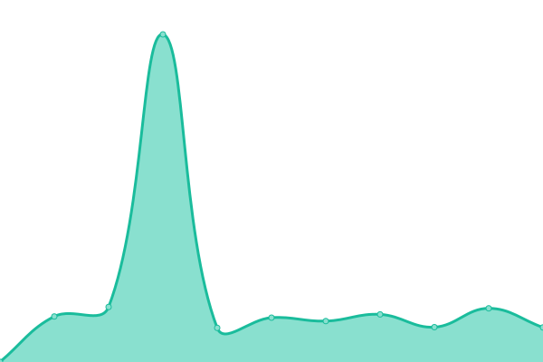
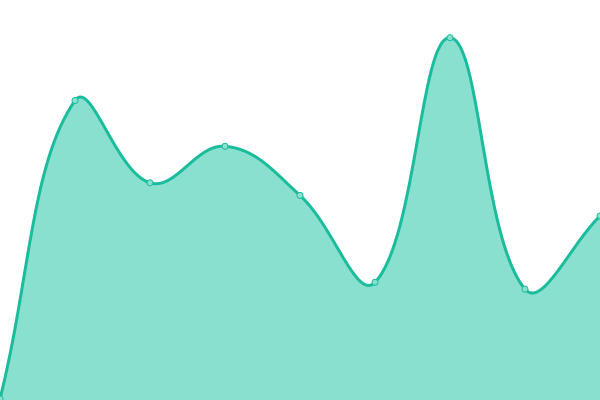
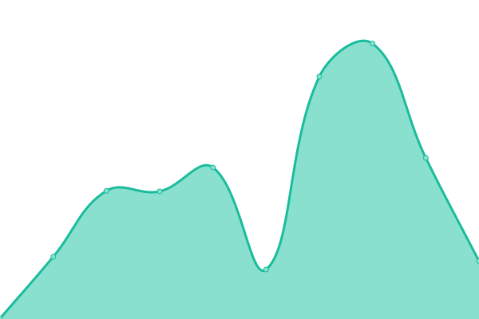
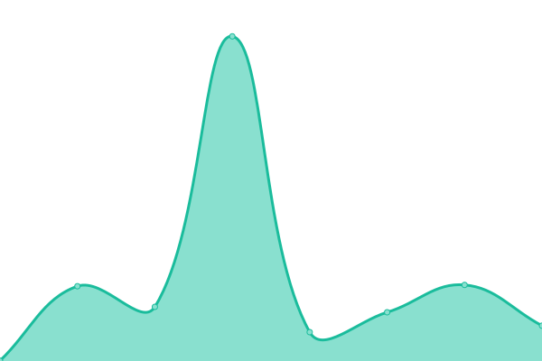

# [📈 Live Status](https://status.rajkumaar.co.in): <!--live status--> **🟩 All systems operational**

This repository contains the open-source uptime monitor and status page for [Rajkumar S](https://rajkumaar.co.in), powered by [Upptime](https://github.com/upptime/upptime).

With [Upptime](https://upptime.js.org), you can get your own unlimited and free uptime monitor and status page, powered entirely by a GitHub repository. We use [Issues](https://github.com/rajkumaar23/status/issues) as incident reports, [Actions](https://github.com/rajkumaar23/status/actions) as uptime monitors, and [Pages](https://status.rajkumaar.co.in) for the status page.

<!--start: status pages-->
<!-- This summary is generated by Upptime (https://github.com/upptime/upptime) -->
<!-- Do not edit this manually, your changes will be overwritten -->
<!-- prettier-ignore -->
| URL | Status | History | Response Time | Uptime |
| --- | ------ | ------- | ------------- | ------ |
|  [Online Home of Rajkumar](https://rajkumaar.co.in) | 🟩 Up | [online-home-of-rajkumar.yml](https://github.com/rajkumaar23/status/commits/HEAD/history/online-home-of-rajkumar.yml) | 

 206ms
     
 | 

<a href="https://status.rajkumaar.co.in/history/online-home-of-rajkumar">100.00%</a>
    

|  [Playstore API](https://api-playstore.rajkumaar.co.in/json?id=in.co.rajkumaar.amritarepo) | 🟩 Up | [playstore-api.yml](https://github.com/rajkumaar23/status/commits/HEAD/history/playstore-api.yml) | 

 274ms
     
 | 

<a href="https://status.rajkumaar.co.in/history/playstore-api">99.43%</a>
    

|  [vCard Editor](https://vcard-editor.rajkumaar.co.in) | 🟩 Up | [v-card-editor.yml](https://github.com/rajkumaar23/status/commits/HEAD/history/v-card-editor.yml) | 

 231ms
     
 | 

<a href="https://status.rajkumaar.co.in/history/v-card-editor">100.00%</a>
    

|  [tls watch](https://tls.rajkumaar.co.in) | 🟩 Up | [tls-watch.yml](https://github.com/rajkumaar23/status/commits/HEAD/history/tls-watch.yml) | 

 83ms
     
 | 

<a href="https://status.rajkumaar.co.in/history/tls-watch">100.00%</a>
    

|  [Pi - Home Page](https://pi.rajkumaar.co.in) | 🟩 Up | [pi-home-page.yml](https://github.com/rajkumaar23/status/commits/HEAD/history/pi-home-page.yml) | 

 211ms
     
 | 

<a href="https://status.rajkumaar.co.in/history/pi-home-page">99.58%</a>
    

|  [Dozzle](https://dozzle.rajkumaar.co.in/healthcheck) | 🟩 Up | [dozzle.yml](https://github.com/rajkumaar23/status/commits/HEAD/history/dozzle.yml) | 

 226ms
     
 | 

<a href="https://status.rajkumaar.co.in/history/dozzle">99.60%</a>
    

|  [CodeChef Contest Arena - API](https://api.codechef-arena.rajkumaar.co.in/healthcheck) | 🟩 Up | [code-chef-contest-arena-api.yml](https://github.com/rajkumaar23/status/commits/HEAD/history/code-chef-contest-arena-api.yml) | 

 211ms
     
 | 

<a href="https://status.rajkumaar.co.in/history/code-chef-contest-arena-api">99.61%</a>
    

|  [Amrita Repository - Telegram Bot](https://amrita-repo-bot.rajkumaar.co.in/healthcheck) | 🟩 Up | [amrita-repository-telegram-bot.yml](https://github.com/rajkumaar23/status/commits/HEAD/history/amrita-repository-telegram-bot.yml) | 

 200ms
     
 | 

<a href="https://status.rajkumaar.co.in/history/amrita-repository-telegram-bot">99.61%</a>
    

<!--end: status pages-->

[**Visit our status website →**](https://status.rajkumaar.co.in)

## 📄 License

- Powered by: [Upptime](https://github.com/upptime/upptime)
- Code: [MIT](./LICENSE) © [Rajkumar S](https://rajkumaar.co.in)
- Data in the `./history` directory: [Open Database License](https://opendatacommons.org/licenses/odbl/1-0/)
